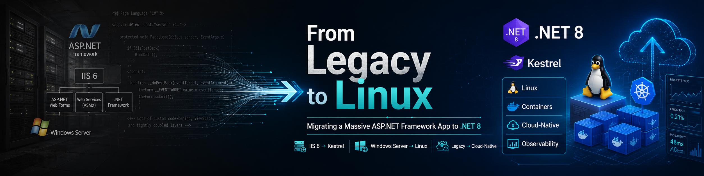

# Modernizing .NET Examples

Code examples for the "Modernizing .NET" article series.

## From Legacy to Linux

This repository accompanies a series about migrating a large ASP.NET Framework 4.8 application to .NET 8 on Linux.

Published on Medium:

- [@michael.kopt](https://medium.com/@michael.kopt)

The original system included:

- 1,000+ C# files
- 400,000+ lines of code
- REST and SOAP services
- SAML authentication
- ASPX UI pages
- Multiple ODBC drivers
- Web References
- PostSharp-based AOP
- Google OAuth integration

The goal of the migration was to move a legacy Windows Server and IIS-hosted application to Linux, Kestrel, and a container-friendly deployment model.

This repository focuses on runnable examples and reduced reproductions of the techniques described in the articles.

## Articles

Each article has its own folder with the same part number as the post:

1. [Part 1: C# Preprocessor Directives](https://medium.com/@michael.kopt/modernizing-net-part-1-c-preprocessor-directives-0db27fa32d8a) - `part-01-c-preprocessor-directives`
2. [Part 2: HttpContext and the Dark Magic of Migration](https://medium.com/@michael.kopt/%EF%B8%8F-modernizing-net-part-2-httpcontext-and-the-dark-magic-of-migration-621b0ce7586c) - `part-02-httpcontext-and-the-dark-magic-of-migration`
3. [Part 3: Surviving SOAP with CoreWCF](https://medium.com/@michael.kopt/modernizing-net-part-3-surviving-soap-with-corewcf-8a947ebd55e9) - `part-03-surviving-soap-with-corewcf`
4. [Part 4: WSDL in CoreWCF](https://medium.com/@michael.kopt/modernizing-net-part-4-wsdl-in-corewcf-3b5e3a390c37) - `part-04-wsdl-in-corewcf`
5. [Part 5: Documentation in CoreWCF](https://medium.com/@michael.kopt/modernizing-net-part-5-documentation-in-corewcf-24814b40e37e) - `part-05-documentation-in-corewcf`
6. [Part 6: Validators in CoreWCF](https://medium.com/@michael.kopt/modernizing-net-part-6-validators-in-corewcf-50c0eb2f2feb) - `part-06-validators-in-corewcf`
7. [Part 7: From Web References to Service References](https://medium.com/@michael.kopt/modernizing-net-part-7-from-web-references-to-service-references-540dcc8352be) - `part-07-from-web-references-to-service-references`
8. [Part 8: ODBC Driver Configuration on Linux](https://medium.com/@michael.kopt/%EF%B8%8F-modernizing-net-part-8-odbc-driver-configuration-on-linux-a9083eabc5bd) - `part-08-odbc-driver-configuration-on-linux`
9. [Part 9: Migrating SAML SSO to ITfoxtec](https://medium.com/@michael.kopt/modernizing-net-part-9-migrating-saml-sso-to-itfoxtec-44133b003702) - `part-09-migrating-saml-sso-to-itfoxtec`
10. [Part 10: Replacing OleDB Excel Reading with ExcelDataReader](https://medium.com/@michael.kopt/modernizing-net-part-10-replacing-oledb-excel-reading-with-exceldatareader-a2cdae1e2cb8) - `part-10-replacing-oledb-excel-reading-with-exceldatareader`
11. [Part 11: Migrating WebClient and RestSharp to HttpClientFactory](https://medium.com/@michael.kopt/modernizing-net-part-11-migrating-webclient-and-restsharp-to-httpclientfactory-c3a74091ef19) - `part-11-migrating-webclient-and-restsharp-to-httpclientfactory`
12. [Part 12: Managing Dependency Injection in Background Threads with SharedContext](https://medium.com/@michael.kopt/modernizing-net-part-12-managing-dependency-injection-in-background-threads-with-sharedcontext-19c66938fedf) - `part-12-managing-dependency-injection-in-background-threads-with-sharedcontext`
13. [Part 13: Replacing PostSharp Audit Attribute with Try-Catch-Finally Pattern](https://medium.com/@michael.kopt/modernizing-net-part-13-replacing-postsharp-audit-attribute-with-try-catch-finally-pattern-b8832aa170a9) - `part-13-replacing-postsharp-audit-attribute-with-try-catch-finally-pattern`
14. [Part 14: Migrating from WebHost to WebApplication in ASP.NET Core](https://medium.com/@michael.kopt/modernizing-net-part-14-migrating-from-webhost-to-webapplication-in-asp-net-core-612a7a8e1b88) - `part-14-migrating-from-webhost-to-webapplication-in-asp-net-core`
15. [Part 15: Custom Session Store for Complex Objects in ASP.NET Core](https://medium.com/@michael.kopt/%EF%B8%8F-custom-session-store-for-complex-objects-in-asp-net-core-1349b680ce12) - `part-15-custom-session-store-for-complex-objects-in-asp-net-core`
16. [Part 16: Replacing BinaryFormatter with protobuf-net](https://medium.com/@michael.kopt/%EF%B8%8F-modernizing-net-part-16-replacing-binaryformatter-with-protobuf-net-for-speed-and-security-f5cc5db8055a) - `part-16-binaryformatter-to-protobuf`
17. [Part 17: Migrating SMTP Email to MailKit](https://medium.com/@michael.kopt/modernizing-net-part-17-migrating-smtp-email-to-mailkit-68b17e8a743f) - `part-17-smtp-to-mailkit`
18. [Part 18: OAuth Authentication in ASP.NET Core](https://medium.com/@michael.kopt/modernizing-net-part-18-oauth-authentication-in-asp-net-core-6f77ed506a7d) - `part-18-oauth-authentication`
19. [Part 19: Migrating In-Memory Dictionaries to Redis](https://medium.com/@michael.kopt/modernizing-net-part-19-migrating-in-memory-dictionaries-to-redis-d8ab37ee354a) - `part-19-dictionary-to-redis`
20. [Part 20: Migrating Legacy ASPX Pages to ASP.NET Core](https://medium.com/@michael.kopt/%EF%B8%8F-modernizing-net-part-20-migrating-legacy-aspx-pages-to-asp-net-core-d855946c3db0) - `part-20-aspx-to-aspnetcore`
21. [Part 21: Migrating WebDAV Server Functionality to .NET Core](https://medium.com/@michael.kopt/modernizing-net-part-21-migrating-webdav-server-functionality-to-net-core-2770bca6f374) - `part-21-webdav-migration`
22. [Part 22: Migrating Configuration Files to .NET Core](https://medium.com/@michael.kopt/modernizing-net-part-22-migrating-configuration-files-to-net-core-0f7436c938b4) - `part-22-configuration-migration`
23. [Part 23: Migrating log4net to Modern .NET Logging](https://medium.com/@michael.kopt/modernizing-net-part-23-migrating-log4net-to-modern-net-logging-0aefab8f0c61) - `part-23-log4net-migration`
24. [Part 24: Modern Monitoring with Prometheus and Grafana](https://medium.com/@michael.kopt/modernizing-net-part-24-modern-monitoring-with-prometheus-and-grafana-3cbfa8a09da0) - `part-24-prometheus-grafana`
25. [Part 25: Rate Limiting Concepts and Strategies](https://medium.com/@michael.kopt/modernizing-net-part-25-rate-limiting-concepts-and-strategies-9df1a8a1c7e7) - `part-25-rate-limiting-concepts`
26. [Part 26: Implementing Rate Limiting Middleware in ASP.NET Core](https://medium.com/@michael.kopt/modernizing-net-part-26-implementing-rate-limiting-middleware-in-asp-net-core-4d8fb87e9930) - `part-26-rate-limiting-middleware`
27. [Part 27: Cross-Platform String Sorting Nuances](https://medium.com/@michael.kopt/modernizing-net-part-27-cross-platform-string-sorting-nuances-0f4f4a1c6c5a) - `part-27-string-sorting`
28. [Part 28: Diagnosing Linux File Operation Memory Spikes](https://medium.com/@michael.kopt/modernizing-net-part-28-diagnosing-linux-file-operation-memory-spikes-08421b69d921) - `part-28-linux-file-memory-spikes`
29. [Bonus Part 29: System.Web Request and Response Wrappers](https://medium.com/@michael.kopt/%EF%B8%8F-bonus-modernizing-net-part-29-bonus-round-with-system-web-request-and-response-wrappers-0abdec1bae8b) - `part-29-system-web-request-response-wrappers`
30. [Part 30: Strangler Fig Architecture](https://medium.com/@michael.kopt/modernizing-net-part-30-strangler-fig-architecture-903da2ce1e9a) - `part-30-strangler-fig-architecture`

Recommended convention inside each part:

- `src/` for runnable sample code

Automated test projects are currently included for:

- Parts 22-28
- Parts 22-30

Earlier parts focus on runnable samples and do not currently include automated test projects.

## Notes

These examples are intentionally separated from the original commercial application. They are meant to illustrate migration patterns, not reproduce the production system.
